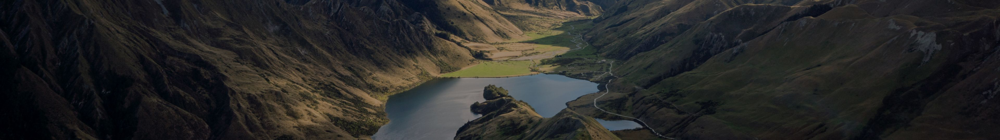

---

# Become a better photographer with Lightroom

---

## Take your photography skills up a notch. Get key tips on composition, light, and color.

[Learn photo fundamentals](photo-fundamentals/)

---
class: video-switcher
data-videos-source: videos.json
---

## Watch how professional photographers edit in Lightroom

- 
- 
- 
- 
- 

---
class: video-card-carousel
data-videos-source: videos.json
---

## Dive deeper into Lightroom

- ### Import photos into your library
  5 min
  Lightroom for Desktop
 
- ### Get to know the editing capabilities in Lightroom
  5 min
  Lightroom for Desktop
 
- ### Apply an edit to a specific area of your photo using the Brush tool
  5 min
  Lightroom for Desktop
 
- ### Blend away unwanted content from your photo with the Healing Brush
  5 min
  Lightroom for Desktop
 
- ### Edit parts of a photo with Radial Gradients
  5 min
  Lightroom for Desktop
 
- ### Get to know the editing capabilities in Lightroom
  5 min
  Lightroom for Desktop
 
- ### Apply an edit to a specific area of your photo using the Brush tool
  5 min
  Lightroom for Desktop
 
- ### Blend away unwanted content from your photo with the Healing Brush
  5 min
  Lightroom for Desktop

---
class: grey
---

### Does your Lightroom look different from the videos?
We have a cloud-based version of Lightroom (Lightroom CC) and desktop version (Lightroom Classic).

[See tutorials for Lightroom Classic](classic/)